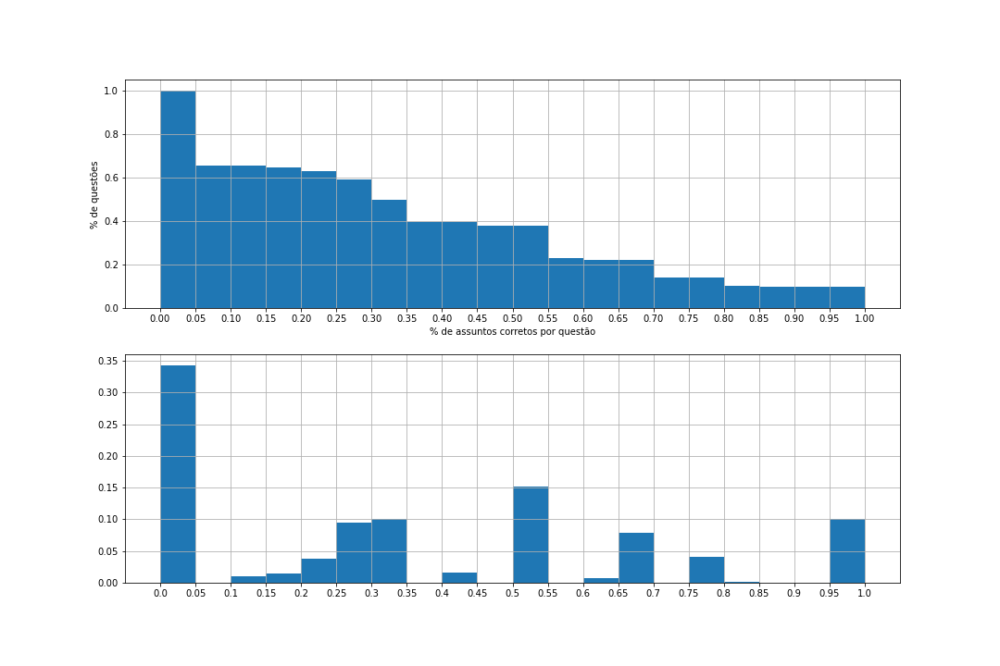

# Classificação de Questões de Vestibular

Modelo de Machine Learning para Classificação de Questões de Vestibular

## I - Exposição do Problema 🚀

Este projeto iniciou-se a partir de um problema da startup em que faço parte. Um certo momento, levantou-se a necessidade de fornecer aos nossos usuários, questões de vestibulares para que eles possam estudar mais e ter mais conteúdos para se darem bem no vestibular.
Assim, criou-se um banco de dados com 120 mil questões
Porém, após validarmos os dados, identificou-se que nem todos as questões estavam classificadas de acordo com o assunto que elas pertenciam.
Assim, surgiu a ideia de implementar um modelo e treiná-lo, a fim de classificar cada questão de acordo com o assunto que essa questão pertence.

### Modelo
Para isso, foi necessário utilizar alguma técnica para a avaliação de textos.
Assim, idealizou-se usar o bag of words. Uma explicação simples é que o bag of words é uma lista que contem todas as palavras que estão nos textos de maneira não repetida.
Utilizamos ela para poder identificar as palavras mais recorrentes e entender se ela agregam na classificação das questões.

## II - Importação dos dados

Como os dados estavam no bando do Mongo. utilizei o framework do MongoDB para conectar e importar os dados para o Python

## III - Preparação dos dados
Para a aquisição das questões, foi feito uma ferramenta de webscrapping para captura das questões.
Assim, os dados são recebidos e inseridos no banco no formato HTML
Com isso, foi necessário convertê-los em texto utilizado a biblioteca BeautifulSoup.

```
from bs4 import BeautifulSoup

for i in range(len(corpus )):
    corpus[i] = corpus[i].lower()
    corpus[i] = BeautifulSoup(corpus [i]).get_text() # transforma o HTML em texto
    corpus [i] = re.sub(r'\W',' ',corpus [i])  # remove os caracteres especiais
    corpus [i] = re.sub(r'\s+',' ',corpus [i]) # remove os caracteres especiais
    
```

Como parte do processo de processamento de texto, é necessário verificar quais palavras são as mais frequentes, para que sejam usadas posteriormente.
Assim, foi utilizado a função "word_tokenize", que pega uma sentença e separa os dados em posições de uma lista.

```
wordfreq = {}
for sentence in corpus:
    tokens = nltk.word_tokenize(sentence)
    for token in tokens:
        if token not in wordfreq.keys():
            wordfreq[token] = 1
        else:
            wordfreq[token] += 1
```

Após criar um array com a frequencia de cada palavra, é necessário eliminar as palavras "irrelevantes" para o nosso problema (stopwords), com o objetivo de reduzir o ruído dos dados analisados. Assim, se a palavra faz parte do conjunto de palavras do meu _stopwords_, altero a frequência da mesma para _zero_.

```
stopwords = nltk.corpus.stopwords.words('portuguese')
for word in wordfreq:
    if word in stopwords:
        wordfreq[word] = 0
    if (word.isnumeric()):  # removendo números
        wordfreq[word] = 0
```

Agora, ordena-se essa lista considerando aqueles termos que aparecem com mais frequência. No nosso caso, selecionamos as 150 palavras mais frequêntes.

```
import heapq

MOST_FREQUENT_NUMBER = 150

most_freq = heapq.nlargest(MOST_FREQUENT_NUMBER, wordfreq, key=wordfreq.get)
```

O ultimo passo é criar o saco de palavras transcrevendo cada documento para uma informação booleana dizendo se cada palavra do saco de palavras está presente ou não no documento. Se a palavra estiver na sentença, coloca 1, se não, 0.

```
sentence_vectors = []
for sentence in corpus:
    sentence_tokens = nltk.word_tokenize(sentence)

    sent_vec = []
    for token in most_freq:
        if token in sentence_tokens:
            sent_vec.append(1)
        else:
            sent_vec.append(0)
    sentence_vectors.append(sent_vec)

sentence_vectors = np.array(sentence_vectors)
```


## IV - Análise exploratória



## V - Modelagem

O modelo proposto foi desenhado de acordo com a classificação já existente no banco de dados. As classificações existentes consistiam na concatenação dos assuntos em que a questão estava envolvida.

Exemplos de classificação:
* Álgebra Matemática Financeira Números
* Noções de lógica Noções de Lógica Matemática
* Álgebra Grandezas e medidas Razão e Proporção

Pode-se observar que há diversos assuntos para uma questão única, o que nos mostra que esse é um problema com multiplas saídas/resultados.

Uma vez que o modelo foi desenhado para classificar os assuntos de matemática, foi necessário separar essa única classificação "conjuntas" em diversas classificações. Assim, levantou-se todas as possibilidades de assuntos existentes no banco de questões de matemática, criando assim um _array_ com 87 assuntos distintos.

```
subjects = ['Álgebra', 'Probabilidade e estatística', 'Números', 'Noções de lógica',
            'Noções de Lógica Matemática', 'Matemática Financeira', 'Grandezas e medidas', 'Razão e Proporção',
            'Geometria', 'Estatística', 'Determinantes', 'Álgebra linear', 'Análise Combinatória', 'Arcos na Circunferência',
            'Área e Perímetro das Figuras Planas', 'Aritmética', 'Arranjo', 'Cálculo diferencial integral', 'Cilindros', 'Circunferência',
            'Circunferência e Círculo', 'Combinação', 'Comprimento', 'Volume', 'Cones', 'Esfera', 'Congruência de Triângulos',
            'Cônicas', 'Conjuntos', 'Conjuntos Função', 'Decimal', 'Equação do Primeiro Grau', 'Equação do Segundo Grau',
            'Equações', 'Equações polinomiais', 'Equações polinomiais Exponenciais', 'Esfera', 'Expressões algébricas', 'Expressões algébricas',
            'Fatorial', 'Função', 'Função Exponencial', 'Função Logarítmica', 'Razões e proporções',
            'Função Quadrática', 'Função Trigonometria', 'Funções Definidas por Várias Sentenças', 'Funções Trigonométricas', 'Fundamentos',
            'Geometria analítica', 'Geometria espacial', 'Geometria plana', 'Gráficos', 'Inequação do Segundo Grau', 'Inequações', 'Inequações polinomiais',
            'Inequações polinomiais', 'Juros Compostos', 'Juros Simples', 'Lógica matemática', 'Prismas', 'Médias',
            'Ponderada', 'Porcentagem', 'Probabilidade', 'Múltiplos e Divisores', 'Notação científica',
            'Outros', 'Permutação', 'Pirâmides', 'Polígonos', 'Porcentagem', 'Princípio Fundamental da Contagem', 'Prismas', 
            'Problemas sobre as 4 operações', 'Razões Trigonométricas no Triângulo Retângulo', 'Relações Métricas do Triângulo Retângulo',
            'Relações Métricas em Triângulos Quaisquer', 'Reta', 'Retas e Planos', 'Sequências', 'Sistema de Numeração e Métrico', 'Superfície Poliédrica e Poliedros',
            'Tempo', 'Trigonometria', 'Troncos', 'Volume']
```

Como feito nas questões, o _output_ foi dividido igual o bag of words implementado no enunciado das questões. Para o treinamento do modelo, foi colocado 1 ou 0 se o assunto pertencia àquela questão ou não.

```
df = documents
for index, document in df.iterrows():
    i = 0
    for subject in subjects:
        i += 1
        column_name = "tag_"+str(i)
        if (subject in document["level_2"]) or (subject in document["level_3"]):
            df.loc[index, subject] = 1
        else:
            df.loc[index, subject] = 0
```
### testes de classificadores

Como o problema consiste em uma classificação de multiplas saídas, foi utilizado a classe _MultiOutputClassifier_ da biblioteca _sklearn_.
Para que essa classe funcione corretamente, é necessário escolher um _estimator_, que, nesse caso, utilizamos o _RandomForestClassifier_.

O nome (Classificador Floresta Aleatória) explica muito bem o funcionamento do algoritmo, que irá criar muitas árvores de decisão, de maneira aleatória, formando o que podemos enxergar como uma floresta, onde cada árvore será utilizada na escolha do resultado final.

Durante o processo de contrução do modelo, tambpem foi testado o _KNeighborsClassifier_ e o _MLPClassifier_, porém com resultados inferiores ao _RandomForestClassifier_.

```
clf = MultiOutputClassifier(RandomForestClassifier(max_depth=24, min_samples_leaf=6))
clf.fit(X_train, y_train)
y_pred = clf.predict(X_test)
```

Agora, é feito o teste para avaliar se o treinamento deu certo.
Crio-se um vetor (hits) que me mostra quais predições foram corretas. Como se trata de um problema de multiplas saídas, foi avaliado se pelo menos 1 assunto foi predito corretamente.
No início, foi testado apenas as classificações que bateram 100% com as classificações de teste, porém, os valores eram muito baixos e não fez sentido ao problema que tínhamos.
Nesse caso e aplicado ao problema que tínhamos, tendo apenas uma ou mais classificações corretas, ja nos atendia e resolvia o problema.

```
hits = np.any((y_pred + y_test) > 1, axis=1)
print("taxa de acerto: ", round(hits.sum()/len(hits)*100,2), "%")
```

Assim, após inúmeros treinos e respostas do modelo, observou-se que temos uma taxa de acerto média de 65%.


########################################################################
● Divisão dos dados em dados de treino e teste
● Criação de um benchmark (modelo inicial para comparações futuras)
● Triagem de modelo(s) para utilização
● Utilização de métricas de mensuração de performance dos algoritmos
● Calibração dos hiperparâmetros do(s) algoritmo(s)

########################################################################
Anotações
########################################################################
classificação

agrupar questões

bag of words
n grams
########################################################################

Seguem as ações que conversamos agora:

1. elaborar a árvore com disciplinas e assuntos que serão mapeados na classificação;

2. preparar a base de dados com questões previamente classificadas dentro segundo os assuntos mapeados na árvore;

3. estudar as primeiras técnicas para classificação de texto como bag-of-words e regressão logística;

4. estudar técnicas mais avançadas para classificação de texto.

--- proposições

########################################################################
removo stopwords

procurar biblioteca com stopwords

sigmoide logistica

cross validation:
separa em 2 partes - uma parte pra treinar - outra pra testar
matriz de confusão.
########################################################################

Tópicos da mentoria 05/06

Converter HTML para texto (ex.: UTF-8, ASCII)

Uso da classe CountVectorizer: https://scikit-learn.org/stable/modules/generated/sklearn.feature_extraction.text.CountVectorizer.html

Stopwords: https://gist.github.com/alopes/5358189

Validação cruzada:

- https://scikit-learn.org/stable/modules/generated/sklearn.model_selection.train_test_split.html
- https://scikit-learn.org/stable/modules/generated/sklearn.model_selection.KFold.html

Matriz de confusão: https://scikit-learn.org/stable/modules/generated/sklearn.metrics.confusion_matrix.html

Atividades posteriores:

- validação cruzada (KFold estratificado): https://scikit-learn.org/stable/modules/generated/sklearn.model_selection.StratifiedKFold.html

- bag of words normalizado (TfidfVectorizer): https://scikit-learn.org/stable/modules/generated/sklearn.feature_extraction.text.TfidfVectorizer.html

- repositório com códigos de exemplo: https://github.com/alex-carneiro/Moving2DS

############################################################################
26/06/2021
Clustering: https://towardsdatascience.com/the-5-clustering-algorithms-data-scientists-need-to-know-a36d136ef68

Clustering com Scikit-Learn: https://scikit-learn.org/stable/modules/clustering.html

Overfit: https://machinelearningmastery.com/overfitting-and-underfitting-with-machine-learning-algorithms/

Distância de Levenshtein: http://people.cs.pitt.edu/~kirk/cs1501/Pruhs/Spring2006/assignments/editdistance/Levenshtein%20Distance.htm

Distância de Levenshtein com Python: https://pypi.org/project/python-Levenshtein/

Uso de votação para associar novas tags para as sentenças após clusterização

TODO: elaborar o pipeline sequencial que descreva as tarefas para agrupamento e mapeamento das questões

Vídeo sobre descrição automática de cenas: https://www.youtube.com/watch?v=40riCqvRoMs

############################################################################
10/07/2021
Como definir o número ideal de clusters para o K Means: https://jtemporal.com/kmeans-and-elbow-method/


########################################
## BAG OF WORDS
### Observações importantes
O saco de palavras permite que você utilize classificadores e faça outras análises posteriormente. Criar um saco de palavra não te dá informação alguma instantaneamente.   O saco de palavras utilizando a incidência das palavras pode ser utilizado, porém, esse modelo possui problemas já bem conhecidos. São eles: (1) “perda” de informação sintática, considerando que se trata de uma abordagem estatística. (2) Modelos que consideram a frequência inversa de palavras no conjunto de documentos já provaram ser mais eficientes em muitos casos.

https://www.computersciencemaster.com.br/como-criar-um-saco-de-palavras-em-python/
########################################

---
⌨️ por [Mauricio Freitas](https://github.com/msfreit)