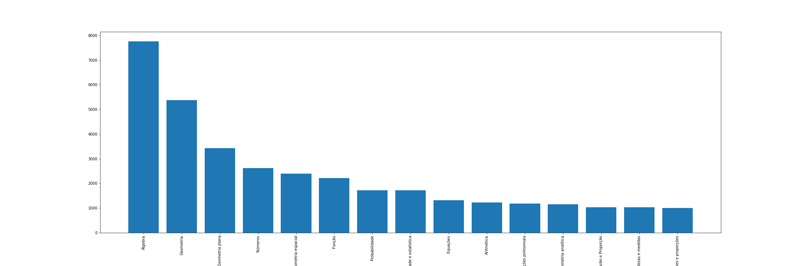
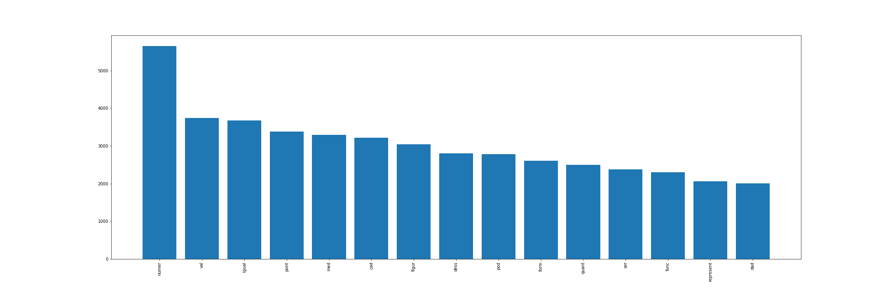
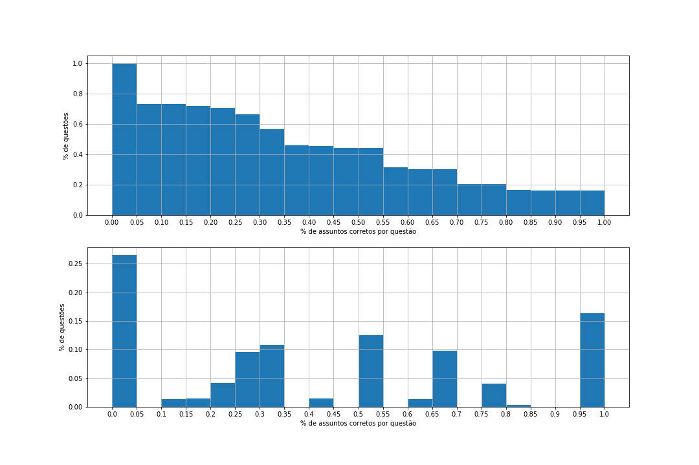
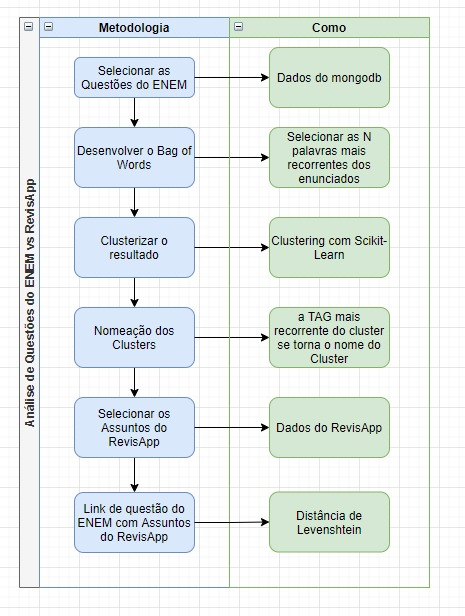

# Classificação de Questões de Vestibular

Modelo de Machine Learning para Classificação de Questões de Vestibular

## I - Exposição do Problema 🚀

Este projeto iniciou-se a partir de um problema da startup em que faço parte. Um certo momento, levantou-se a necessidade de fornecer aos nossos usuários, questões de vestibulares para que eles possam estudar mais e ter mais conteúdos para irem bem no vestibular.
Com isso, houve a necessidade de adicionar no nosso sistema, questões de vestibular. Assim, criou-se um banco de dados com 120 mil questões de vestibular.
Porém, após validarmos os dados, identificamos que nem todos as questões estavam classificadas de acordo com o assunto que elas pertenciam, o que nos daria um enorme trabalho para classificá-las manualmente.
Assim, surgiu a ideia de implementar um modelo e treiná-lo, a fim de classificar cada questão de acordo com o assunto que essa questão pertence.

### O Sistema 💻

Para que esse trabalho seja automatizado de uma forma inteligente, foi idealizado um sistema para a avaliação de textos, com o objetivo de ler, intepretar e classificar as questões de acordo com o conteúdo de cada questão.
Com isso, o modelo iniciou-se com a preparação e limpeza dos dados, seguido da implementação do bag of words, função essa que tem como objetivo identificar as palavras mais recorrentes e entender se elas agregam na classificação das questões.
Após a implementação, foi validado se as palavras tinham valor semântico para o treinamento do modelo, onde descobriu-se a necessidade de remover algumas palavras.
Assim, com essa limpeza de dados, desenvolveu-se o modelo que, em sua média, tem dado uma taxa de acerto de 74%.

## II - Importação dos dados 🎲

Como dito anteriormente, foi feito um banco de dados com as 120 mil questões. Para o desenvolvimento da análise, foram selecionados apenas questões de matemática.
Assim, como os dados estavam no banco do NoSQL do MongoDB, foi utilizado um framework do próprio Mongo para conectar e importar os dados para o Python.

```
client = MongoClient(config["MONGO_CONNECTION_STRING"])
database = client["revisapp"]
collection = database["questions"]

query["subjectName"] = u"matematica"

cursor = collection.find(query, projection=projection, sort=sort, limit=40000)
questoes = pd.array(list(cursor))

client.close()
```

Como apenas foi selecionado matemática, houve somente a seleção da matéria em questão.

## III - Preparação dos dados 🔨

Na fase de aquisição das questões, foi feito uma ferramenta de webscrapping para a captura das questões. Assim, os dados foram recebidos e inseridos no banco no formato HTML, uma vez que pra apresentação, também utilizamos a linguagem HTML.
Com isso, para uma análise mais acertiva, foi necessário convertê-los em texto utilizado a biblioteca BeautifulSoup.

```
from bs4 import BeautifulSoup

for i in range(len(corpus )):
    corpus[i] = corpus[i].lower()
    corpus[i] = BeautifulSoup(corpus [i]).get_text() # transforma o HTML em texto
    corpus [i] = re.sub(r'\W',' ',corpus [i])  # remove os caracteres especiais
    corpus [i] = re.sub(r'\s+',' ',corpus [i]) # remove os caracteres especiais
    
```

Uma vez que os dados foram limpos e com seus caracteres especias removidos, foi necessário fazer o processo de _Stemming_, que consiste em reduzir palavras relacionadas a uma forma mínima comum, de forma que possam ser combinadas sob uma única representação, chamada de _stem_. Com este processo, obtém-se índices mais enxutos, melhorando assim a qualidade dos dados para o modelo.

Assim, foi criado uma função com esse objetivo, utilizando a biblioteca _nltk.stem_.

```
from nltk.tokenize import word_tokenize
from nltk.stem import RSLPStemmer
from unidecode import unidecode

stemmer = RSLPStemmer()

def stemSentence(sentence):
    token_words = word_tokenize(sentence)
    token_words
    stem_sentence = []
    for word in token_words:
        if word not in nltk.corpus.stopwords.words('portuguese'):
            word = stemmer.stem(word)
            word = unidecode(word)
            stem_sentence.append(word)  
            stem_sentence.append(" ")
    return "".join(stem_sentence)
```

Essa função criada, além de fazer o _stem_, também remove os acentos e os _stopwords_. 
Os _stopwords_ são palavras que podem ser consideradas irrelevantes para o conjunto de resultados a ser exibido em uma busca realizada em uma search engine. Exemplos: as, e, os, de, para, com, sem, foi, etc..

Assim, as palavras a serem consideradas são reduzidas, conforme exemplo abaixo::

```
'med centimetr lad triangul express x 1 2x x2 5 progress aritme ness ord calcul perimetr triangul ',
'sequ figur desenh malh quadricul indic tre prim etap form fract cad quadr dess malh are 1 cm2 ',
'consider med metr lad triangul progress geometr ness ord express x 1 2x x2 corret afirm perimetr dess triangul med ',
'sequ infinit triangul equilater pod ser constru inscrev triangul dentr outr part prim ',
'consid triangul i ii iii caracter abaix atraves med lad triangul i 9 12 15 triangul ii 5 12 13 triangul iii 5 7 9 qual triangul retangul med lad progress aritme ',
'sequ x 1 2x 1 5x 3 constitu progress aritme tre term cuj val represent med centimetr lad triangul dess mod corret afirm perimetr dess triangul centimetr igual ',
```

Como parte do processo de processamento de texto, é necessário verificar quais palavras são as mais frequentes, para que sejam usadas posteriormente.
Assim, foi utilizado a função "word_tokenize", que pega uma sentença e separa os dados em posições de uma lista.

```
wordfreq = {}
for sentence in corpus:
    tokens = nltk.word_tokenize(sentence)
    for token in tokens:
        if token not in wordfreq.keys():
            wordfreq[token] = 1
        else:
            wordfreq[token] += 1
```

Agora, ordena-se essa lista considerando aqueles termos que aparecem com mais frequência. No nosso caso, selecionamos as 150 palavras mais frequêntes.

```
import heapq

MOST_FREQUENT_NUMBER = 150

most_freq = heapq.nlargest(MOST_FREQUENT_NUMBER, wordfreq, key=wordfreq.get)
```

O ultimo passo é criar o saco de palavras transcrevendo cada documento para uma informação booleana dizendo se cada palavra do saco de palavras está presente ou não no documento. Se a palavra estiver na sentença, coloca 1, se não, 0.

```
sentence_vectors = []
for sentence in corpus:
    sentence_tokens = nltk.word_tokenize(sentence)

    sent_vec = []
    for token in most_freq:
        if token in sentence_tokens:
            sent_vec.append(1)
        else:
            sent_vec.append(0)
    sentence_vectors.append(sent_vec)

sentence_vectors = np.array(sentence_vectors)
```

Uma vez que o modelo foi desenhado para classificar os assuntos de matemática, foi necessário separar essa única classificação "conjuntas" em diversas classificações. Assim, levantou-se todas as possibilidades de assuntos existentes no banco de questões de matemática, criando assim um _array_ com 81 assuntos distintos.

```
subjects = ['Álgebra', 'Probabilidade e estatística', 'Números', 'Noções de lógica',
            'Noções de Lógica Matemática', 'Matemática Financeira', 'Grandezas e medidas', 'Razão e Proporção',
            'Geometria', 'Estatística', 'Determinantes', 'Álgebra linear', 'Análise Combinatória', 'Arcos na Circunferência',
            'Área e Perímetro das Figuras Planas', 'Aritmética', 'Arranjo', 'Cálculo diferencial integral', 'Cilindros', 'Circunferência',
            'Circunferência e Círculo', 'Combinação', 'Comprimento', 'Volume', 'Cones', 'Esfera', 'Congruência de Triângulos',
            'Cônicas', 'Conjuntos', 'Conjuntos Função', 'Decimal', 'Equação do Primeiro Grau', 'Equação do Segundo Grau',
            'Equações', 'Equações polinomiais', 'Equações polinomiais Exponenciais', 'Esfera', 'Expressões algébricas', 'Expressões algébricas',
            'Fatorial', 'Função', 'Função Exponencial', 'Função Logarítmica', 'Razões e proporções',
            'Função Quadrática', 'Função Trigonometria', 'Funções Definidas por Várias Sentenças', 'Funções Trigonométricas', 'Fundamentos',
            'Geometria analítica', 'Geometria espacial', 'Geometria plana', 'Gráficos', 'Inequação do Segundo Grau', 'Inequações', 'Inequações polinomiais',
            'Inequações polinomiais', 'Juros Compostos', 'Juros Simples', 'Lógica matemática', 'Prismas', 'Médias',
            'Ponderada', 'Porcentagem', 'Probabilidade', 'Múltiplos e Divisores', 'Notação científica',
            'Outros', 'Permutação', 'Pirâmides', 'Polígonos', 'Princípio Fundamental da Contagem', 'Prismas', 
            'Problemas sobre as 4 operações', 'Razões Trigonométricas no Triângulo Retângulo', 'Relações Métricas do Triângulo Retângulo',
            'Relações Métricas em Triângulos Quaisquer', 'Reta', 'Retas e Planos', 'Sequências', 'Sistema de Numeração e Métrico', 'Superfície Poliédrica e Poliedros',
            'Tempo', 'Trigonometria', 'Troncos']
```

Como feito nas questões, o _output_ foi dividido igual o bag of words implementado no enunciado das questões. Para o treinamento do modelo, foi colocado 1 ou 0 se o assunto pertencia àquela questão ou não.

```
df = documents
for index, document in df.iterrows():
    i = 0
    for subject in subjects:
        i += 1
        column_name = "tag_"+str(i)
        if (subject in document["level_2"]) or (subject in document["level_3"]):
            df.loc[index, subject] = 1
        else:
            df.loc[index, subject] = 0
```

## IV - Análise exploratória 🤓

A análise exploratória deve ser feita antes de qualquer tipo de modelagem em si. Esse passo é essencial entender a natureza dos dados e também para resumir suas características principais.
Para isso, foi feito a distribuição dos dados através da plotagem de histogramas.

Assim, algumas questões foram levantadas para que os dados nos respondessem, conforme a seguir.

### Quais são os assuntos mais recorrentes?

Foi verificado os assuntos de matemática mais recorrentes, para entender a distribuição dos valores.



Verificou-se que os assuntos de Álgebra e Geometria dominavam as questões. São os assuntos mais recorrentes em matemática nos vestibulares. Após isso, os assuntos de Geometria Espacial, Funções, Probabilidade tiveram menor peso.

### Quais são as palavras mais recorrentes?

Foi validado quais eram as palavras mais recorrentes, com o objetivo de validar se não haviam palavras que não deveriam estar presentes.



Primeiramente, na validação inicial, identificou-se que haviam muitas algaritmos usados em matemática como "palavras" recorrentes, como exemplo o _x_, _y_, _i_, etc..
Assim, foi necessário voltar ao passo da limpeza dos dados para que esses algaritmos fossem removidos, removendo assim suas frequencias da nossa lista de palavras mais frequentes.

```
for word in wordfreq:
    if (len(word)) < 2: # removendo variáveis (exemplo: x, y, etc..)
        wordfreq[word] = 0
    if (word.isnumeric()):  # removendo "números" 
        wordfreq[word] = 0
```
Assim, foi criado uma nuvem de palavra para mostrar quais as palavras mais recorrentes, e foi verificado que todas as mais recorrentes eram palavras válidas, com significado semântico.


Com essa limpeza de dados que a análise exploratória nos apontou a necessidade, tivemos uma melhora considerável na taxa de acerto das predições, saindo de uma média de 55% de acerto para aproximadamente 74%.

## V - Modelagem 🔥

O modelo proposto foi desenhado de acordo com a classificação já existente no banco de dados. As classificações existentes consistiam na concatenação dos assuntos em que a questão estava envolvida.

Exemplos de classificação:
* Álgebra Matemática Financeira Números
* Noções de lógica Noções de Lógica Matemática
* Álgebra Grandezas e medidas Razão e Proporção

Pode-se observar que há diversos assuntos para uma questão única, o que nos mostra que esse é um problema com multiplas saídas/resultados.


### testes de classificadores

Como o problema consiste em uma classificação de multiplas saídas, foi utilizado a classe _MultiOutputClassifier_ da biblioteca _sklearn_.
Para que essa classe funcione corretamente, é necessário escolher um _estimator_, que, nesse caso, utilizamos o _RandomForestClassifier_.

O nome (Classificador Floresta Aleatória) explica muito bem o funcionamento do algoritmo, que irá criar muitas árvores de decisão, de maneira aleatória, formando o que podemos enxergar como uma floresta, onde cada árvore será utilizada na escolha do resultado final.

Durante o processo de contrução do modelo, tambpem foi testado o _KNeighborsClassifier_ e o _MLPClassifier_, porém com resultados inferiores ao _RandomForestClassifier_.

```
clf = MultiOutputClassifier(RandomForestClassifier(max_depth=24, min_samples_leaf=6))
clf.fit(X_train, y_train)
y_pred = clf.predict(X_test)
```

Agora, é feito o teste para avaliar se o treinamento deu certo.
Crio-se um vetor (hits) que me mostra quais predições foram corretas. Como se trata de um problema de multiplas saídas, foi avaliado se pelo menos 1 assunto foi predito corretamente.
No início, foi testado apenas as classificações que bateram 100% com as classificações de teste, porém, os valores eram muito baixos e não fez sentido ao problema que tínhamos.
Nesse caso e aplicado ao problema que tínhamos, tendo apenas uma ou mais classificações corretas, ja nos atendia e resolvia o problema.

```
hits = np.any((y_pred + y_test) > 1, axis=1)
print("taxa de acerto: ", round(hits.sum()/len(hits)*100,2), "%")
```

Assim, após inúmeros treinos e respostas do modelo, observou-se que temos uma taxa de acerto média de 74%.

Também, foi feito o plot dos valores do modelo, com o objetivo de entender como ficou a distribuição dos acertos. 



Observando os gráficos de respostas acima, é possivel concluir que, aproximadamente 26% das questões tiveram menos de 0 acertos.
Aproximadamente 16% das questões tiveram 100% de acerto na predição do modelo.
Como o o problema em questão era apontar os assuntos existente na questão, considerou-se apenas as predições com pelo menos 1 acerto, totalizando assim 74% de acertividade.

## VI - Fechamento 🔒

Inicialmente, foi desenhado um modelo para a clusterização das questões, conforme desenho a seguir:



Porém, após o melhor conhecimento dos dados, foi identificado que o modelo idealizado não funcionaria para a solução. Assim, durante o trajeto do projeto, foi alterado a solução.
Da implementação, foi extraído um modelo que será utilizado no aplicativo RevisApp. A idéia é utilizar o modelo para otimizar os estudos dos usuários do _app_ através de uma funcionalidade ainda em implementação. Com isso, poderemos indicar aos nossos usuários quais assuntos ele tem mais dificuldade e, consequentemente, quais precisam ser estudados com mais intensidade, sugerindo assim o conteúido e questões similares dos assuntos em déficit de conhecimento.
A implementação deste modelo foi desafiador. A falta de visão matemática dos dados atrapalhou um pouco o desenvolvimento do modelo. A mentoria realizada pela equipe de profissionais da awari foi fundamental em todo o processo de desenvolvimento, monstrando onde estavam os gaps do meu conhecimento e onde eu poderia melhorar para chegar no resultado final.
Também, conclui-se que é necessário entender os seus dados para implementação do modelo. Durante a implementação, foi percebido que o mesmo modelo necessitará de ajustes e adaptações para outras matérias.
A limpeza feita para matemática não é a mesma limpeza de dados a ser feita para biologia, por exemplo.

## VII - Referências 🕮

Natural Language Toolkit:
 - https://www.nltk.org/

Bag of Words:
 - https://www.mygreatlearning.com/blog/bag-of-words/

Stemming and Lemmatization in Python:
 - https://www.datacamp.com/community/tutorials/stemming-lemmatization-python

Splitting data:
- https://scikit-learn.org/stable/modules/generated/sklearn.model_selection.train_test_split.html

Validação cruzada:
- https://scikit-learn.org/stable/modules/generated/sklearn.model_selection.KFold.html

Multi target classification:
 - https://scikit-learn.org/stable/modules/generated/sklearn.multioutput.MultiOutputClassifier.html

---
⌨️ por [Mauricio Freitas](https://github.com/msfreit)